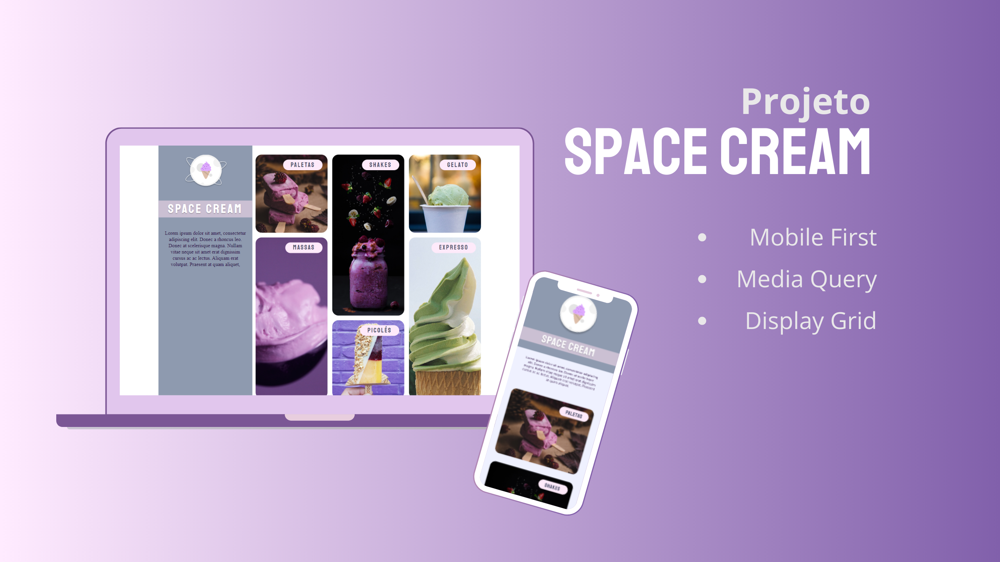

# Desafio HTML e CSS - Mobile First e Display Grrid

## Space Cream
Este projeto é um desafio da trilha Explorer da Rocketseat.

O objetivo deste desafio é treinar o uso das linguagens HTML5 e CSS3 aprendidas no Stage 3, reconstruindo uma aplicação do zero a partir de um layout [figma](https://www.figma.com/file/drBBktNRdtCIUiN4cZk4yo/Stage-03---Mobile-First/duplicate) criado pela equipe da Rocketseat.

Acesse o site clicando [aqui](https://jamisonmmartins.github.io/space-cream/).

## Tecnologias Utilizadas
 

