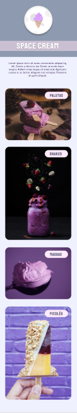

# Desafio HTML e CSS - Mobile First

Este projeto é um desafio da trilha Explorer, turma 8, da Rocketseat.

O objetivo deste desafio é treinar o uso das linguagens HTML5 e CSS3 aprendidas no Stage 3, reconstruindo uma aplicação do zero a partir de um layout [figma](https://www.figma.com/file/drBBktNRdtCIUiN4cZk4yo/Stage-03---Mobile-First/duplicate) criado pela equipe da Rocketseat.

## Conhecimentos Aplicados

Neste desafio utilizei variáveis no CSS para background, cores, tamanhos e tipografia de fonte. Em CSS também utilizei o seletor * para padronizar em todos os elementos HTML o valor zero para os atibutos padding e margin. Além destes, o box-sizing com valor border-box. Para disposição das imagens foi configurado display grid, com uma única coluna e espaçamento de 32px. As imagens e seus títulos possuem animações, configurado com o atributo animation-name, animation duration.

Acesse o site clicando [aqui](https://jamisonmmartins.github.io/space-cream/).

## Tecnologias Utilizadas
 

## Screenshots

