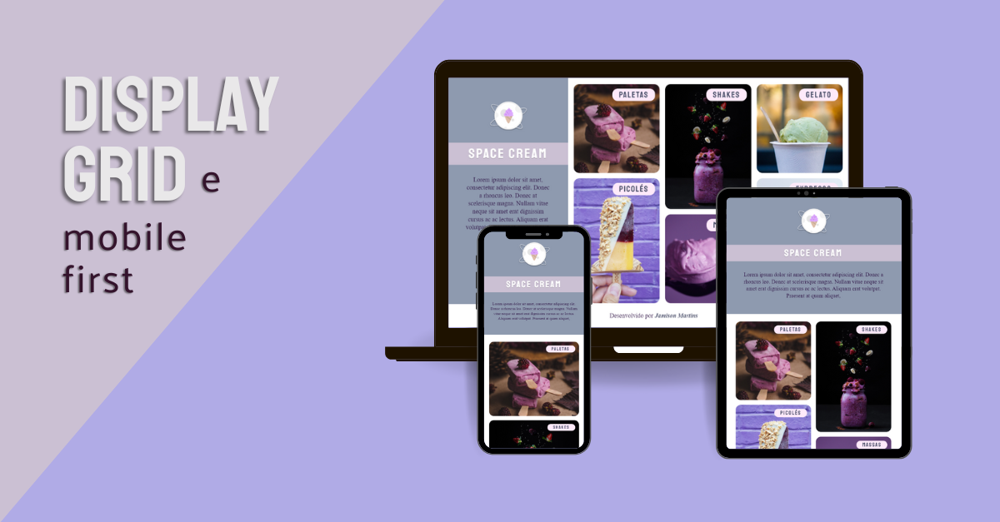

# <a href="https://jamisonmmartins.github.io/space-cream" target="_blank">Space Cream </a>

Este projeto consiste na criação de um site responsivo utilizando HTML5 e CSS3. O layout foi fornecido pelo Figma, garantindo uma base visual consistente. O principal foco é a implementação de uma estrutura semântica em HTML, proporcionando uma experiência de usuário acessível e amigável aos motores de busca.descrição

## Pré-requisitos
Certifique-se de ter os seguintes requisitos instalados antes de prosseguir:

- Navegador moderno que suporte HTML5 e CSS3.

## Instalação

Não é necessário instalação para este projeto.

## Layout
O layout deste projeto foi baseado no design fornecido pelo Figma. Você pode visualizar os layouts clicando nos links abaixo.

[Figma - Layout Desktop](https://www.figma.com/file/Ouzsq7i4tXdAAldhpmFBm6/Stage-03---Grid-com-anima%C3%A7%C3%B5es-(Copy)?type=design&node-id=0%3A1&mode=dev)
 |  [Figma - Layout Mobile](https://www.figma.com/file/0lrsFsmXi1Od4hd3P9Faag/Stage-03---Mobile-First-(Copy)?type=design&mode=dev)

## Tecnologogias Utilizadas

###  

Implementação de marcação semântica para estruturar o conteúdo de forma clara e significativa. Utilização de tags apropriadas, como &lt;header&gt;, &lt;nav&gt;, &lt;main&gt;, &lt;section&gt;, &lt;article&gt;, &lt;footer&gt;, entre outras.

###    

Estilização do site, com ênfase na utilização do Display Grid para criar layouts flexíveis e responsivos. Media Queries foram empregadas para garantir a adaptação do design a diferentes tamanhos de tela, seguindo o conceito Mobile First para uma experiência consistente em dispositivos móveis e desktop. 

## Contribuição
Sinta-se à vontade para contribuir com melhorias ou correções. Crie uma branch, faça as alterações e abra um pull request.
